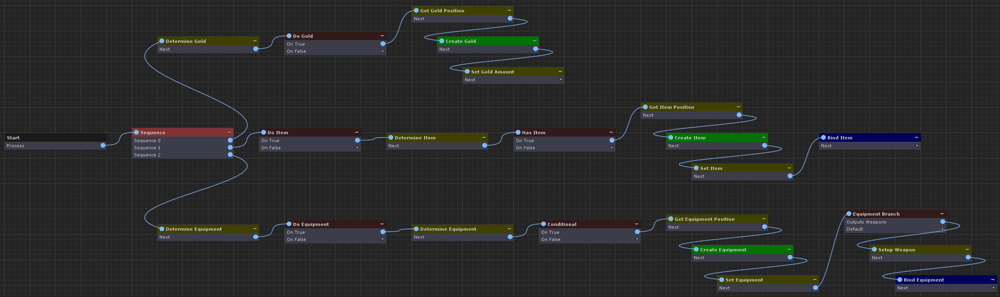
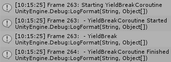
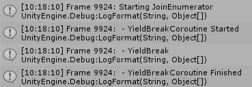

# Yielding Coroutines Without Delay

The title of this post might seem contradictory since the purpose of [coroutines](https://docs.unity3d.com/Manual/Coroutines.html) in [Unity](https://unity.com/) is to _intruduce_ delay, but for our soon to be released [Composition Framework](https://pirhosoft.com/projects/unity-composition) we needed this delay to be optional. The framework implements a [graph](https://pirhosoft.com/projects/unity-composition/documentation/#/v10/manual/instruction-graph) based execution model where different [nodes](https://pirhosoft.com/projects/unity-composition/documentation/#/v10/manual/instruction-graph-node) can be connected together to perform custom game logic. These graphs are executed with a coroutine so nodes can easily perform asynchronous tasks like animation. However some nodes, or even entire graphs, need to complete immediately without any frame delay, which is not possible out of the box.



> This graph completes its execution in a single frame despite yielding on each node using the technique described in this post.

## Background on Coroutines

A coroutine in Unity is effectively a wrapper for an iterator method (i.e a method returning an [IEnumerator](https://docs.microsoft.com/en-us/dotnet/api/system.collections.ienumerator) that has at least one yield statement). Calling one of these iterator methods does not actually execute it - instead it creates an instance of a compiler generated class. This class is given to Unity for processing with [StartCoroutine](https://docs.unity3d.com/ScriptReference/MonoBehaviour.StartCoroutine.html) and the yield statements in the iterator method tell Unity how to process it. Yielded values come in three different flavors: classes derived from [YieldInstruction](https://docs.unity3d.com/ScriptReference/YieldInstruction.html), classes implementing [IEnumerator](https://docs.microsoft.com/en-us/dotnet/api/system.collections.ienumerator), and anything else. The [CustomYieldInstruction](https://docs.unity3d.com/ScriptReference/CustomYieldInstruction.html) class is itself just an [IEnumerator](https://docs.microsoft.com/en-us/dotnet/api/system.collections.ienumerator).

* [YieldInstruction](https://docs.unity3d.com/ScriptReference/YieldInstruction.html) derived types each have custom handling
* [IEnumerators](https://docs.microsoft.com/en-us/dotnet/api/system.collections.ienumerator) are automatically wrapped with a [StartCoroutine](https://docs.unity3d.com/ScriptReference/MonoBehaviour.StartCoroutine.html) call (that may not be exactly what happens internally but it is functionally equivalent)
* 'Anything else' will always defer execution for one frame

## The Goal

We are trying to add the ability to call iterator methods from other iterator methods (effectively yielding an IEnumerator) without introducing any delay and without disrupting any of the other coroutine functionality. By default, yielding an IEnumerator will always result in at least one frame of delay even if the iterator method only contains `yield break`.

```c#
public void YieldBreakTest()
{
	Log("Starting YieldBreakCoroutine");
	StartCoroutine(YieldBreakCoroutine());
}

private IEnumerator YieldBreakCoroutine()
{
	Log(" - YieldBreakCoroutine Started");
	yield return YieldBreak();
	Log(" - YieldBreakCoroutine Finished");
}

private IEnumerator YieldBreak()
{
	Log(" - YieldBreak");
	yield break;
}
```

The `Log` method prints a message to Unity's console with a frame number so we can see where delays are introduced. Here is the output from calling `YieldBreakTest`:



Some takeaways: the first two log messages are called on the same frame. That means Unity executes the first iteration of a coroutine (up to the first yield statement) immediately when it is started. And the last two messages are logged a frame apart meaning after `YieldBreak` finished, `YieldBreakCoroutine` did not resume until the next frame (this is the behavior we want to eliminate).

And as a quick aside, here is the above example restructured slightly to validate some of the earlier statements:

```c#
public void YieldBreakAlternateTest()
{
	var yieldBreak = YieldBreakAlternateCoroutine();
	Log("Starting YieldBreakCoroutine");
	StartCoroutine(yieldBreak);
}

private IEnumerator YieldBreakAlternateCoroutine()
{
	Log(" - YieldBreakCoroutine Started");
	yield return StartCoroutine(YieldBreak());
	Log(" - YieldBreakCoroutine Finished");
}
```


Notice specifically that calling `YieldBreakCoroutine` before `StartCoroutine` does not change the order of the first two log messages and nothing seems to change when calling `YieldBreak` directly rather than with `StartCoroutine`.

## The JoinEnumerator

Because there is no other way to call iterator methods, the only solution is to intercept the yielded values and process them manually. Processing an [IEnumerator](https://docs.microsoft.com/en-us/dotnet/api/system.collections.ienumerator) is very simple - just call `MoveNext()` in a loop until it returns false and check `Current` on each iteration to get the yielded value. In this scenario it is slightly more complex because we want to leave the processing of all yields other than IEnumerator up to Unity but it still remains relatively straight forward.

```c#
using System.Collections;
using System.Collections.Generic;
using UnityEngine;

namespace PiRhoSoft
{
	public class JoinEnumerator : IEnumerator
	{
		private IEnumerator _root;
		private Stack<IEnumerator> _enumerators = new Stack<IEnumerator>(10);

		public object Current
		{
			get { return _enumerators.Peek().Current; }
		}

		public JoinEnumerator(IEnumerator coroutine)
		{
			_root = coroutine;
			_enumerators.Push(coroutine);
		}

		public bool MoveNext()
		{
			while (_enumerators.Count > 0)
			{
				var enumerator = _enumerators.Peek();
				var next = enumerator.MoveNext();

				if (!next)
					_enumerators.Pop();
				else if (enumerator.Current is IEnumerator child && !(child is CustomYieldInstruction))
					_enumerators.Push(child);
				else
					break;
			}

			return _enumerators.Count > 0;
		}

		public void Reset()
		{
			while (_enumerators.Count > 0)
				_enumerators.Pop();

			_enumerators.Push(_root);
			_root.Reset();
		}
	}
}
```

The JoinEnumerator maintains a call stack so IEnumerators can be continued after their child has finished, and `Current` values are maintained and propogated so Unity can process them. In `MoveNext()` the wrapped enumerator's `MoveNext` is called to advance the iterator. There are three scenarios we need to handle depending on the value returned and the enumerators `Current` value (i.e the value it yielded).

### `next` is `true` and `Current` is an IEnumerator

This is where we solve the root problem. Instead of yielding the IEnumerator back for Unity to process it, we process it ourselves by adding it to the callstack. This IEnumerator will then be processed on the next iteration of the loop (that is the while loop in `MoveNext`). [CustomYieldInstruction](https://docs.unity3d.com/ScriptReference/CustomYieldInstruction.html) is a special case because it is itself an IEnumerator but we want Unity to handle it.

### `next` is `false`

The IEnumerator has finished. Normally this is where a frame delay would be introduced but since we are handling processing ourselves, we can continue executing the calling IEnumerator immediately.

### `next` is `true` and `Current` is Something Else

In this scenario we want to actually yield and allow Unity to handle `Current`. Breaking out of the loop and returning from `MoveNext` accomplishes that.

Using the JoinEnumerator now allows any depth of IEnumerators to be yielded without introducing any delay except those that are specifically requested by yielding a [YieldInstruction](https://docs.unity3d.com/ScriptReference/YieldInstruction.html), [CustomYieldInstruction](https://docs.unity3d.com/ScriptReference/CustomYieldInstruction.html), or `null`.

Usage is simple - just wrap the coroutine method in a JoinEnumerator:

```c#
public void YieldBreakJoinedTest()
{
	Log("Starting JoinEnumerator");
	StartCoroutine(new JoinEnumerator(YieldBreakCoroutine()));
}
```



Notice all the log messages are printed on the same frame - mission accomplished!

The JoinEnumerator and example behavior (including a longer coroutine that demonstrates all the yield types) can be found in this MIT licensed [GitHub project](https://github.com/pirhosoft/JoinEnumeratorDemo).